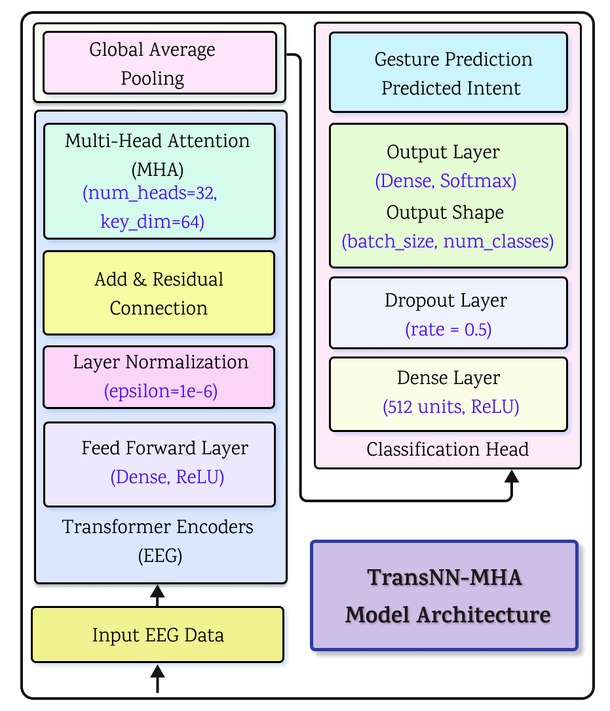

# EEG-Based Intent Recognition and Robotic Control using Transformer Networks


## Project Overview

This repository contains the implementation of TransNN-MHA: A Transformer-Based Model to Distinguish Real and Imaginary Motor Intent for Assistive Robotics, a novel transformer architecture designed to classify motor intent from EEG signals. Built on a transformer backbone with multi-head attention mechanisms, TransNN-MHA processes time-series EEG data to differentiate between real and imagined movements, enabling precise and responsive control in assistive robotic systems. The model is evaluated on the PhysioNet Motor Imagery dataset and includes baseline comparisons, ablation studies, and performance metrics such as ROC and precision-recall curves. This research contributes to the field of brain-computer interfaces (BCIs) by enabling real-time, high-accuracy intent recognition and has been successfully integrated into a closed-loop system for human-robot interaction. The work has been accepted in IEEE Access journal and aims to advance multimodal neuro-robotic control systems for individuals with motor impairments.

## Key Features

-  Accurately **distinguishes between real and imagined motor tasks using EEG signals**, vital for users with motor impairments.

-  Employs a lightweight **Transformer with Multi-Head Attention (MHA)** to capture both local and global temporal features in EEG data.

-  **Comprehensive Preprocessing Pipeline**. Uses ICA, bandpass and notch filters, z-score normalization, and spectral feature extraction to clean EEG data.

-  Extracts **70 domain-specific features** with **SHAP-based explanation** to highlight feature importance.

-  **SMOTE for Data Imbalance**. Balances classes in the training set using synthetic oversampling while keeping the test data untouched.

-  **Subject-Independent 6-Fold Cross-Validation**. Ensures robust model performance across subjects by using separate individuals for training and testing.

-  Achieves **92.39% accuracy ±1.34%**, outperforming CNN-Transformer, GRU-Transformer, and various ML baselines.

-  **Simplifies** Transformer without positional encodings or decoders, making it suitable for embedded deployment.

- Tailored for use in BCI-driven **assistive systems** for prosthetics and neurorehabilitation.

---


##  Model Architecture


<p align="center">
  
  <br>
  <em>Figure: Architecture of the TransNN-MHA Transformer Model for Intent Recognition.</em>
</p>


##  Dataset

The dataset used is **publicly available from PhysioNet**:

> EEG Motor Movement/Imagery Dataset  
> https://physionet.org/content/eegmmidb/1.0.0/

- Subjects: 109 participants  
- Channels: 64-channel EEG  
- Tasks: Real and imaginary motor movements (left hand, right hand, both hands, feet)

##  Getting Started

### 1. Citation

```bash

@article{sultan2025transnn,
  title={TransNN-MHA: A Transformer-Based Model to Distinguish Real and Imaginary Motor Intent for Assistive Robotics},
  author={Sultan, Tipu and Liu, Guangping and Sikorski, Pascal and Babaiasl, Madi},
  journal={IEEE Access},
  year={2025},
  publisher={IEEE}
}


